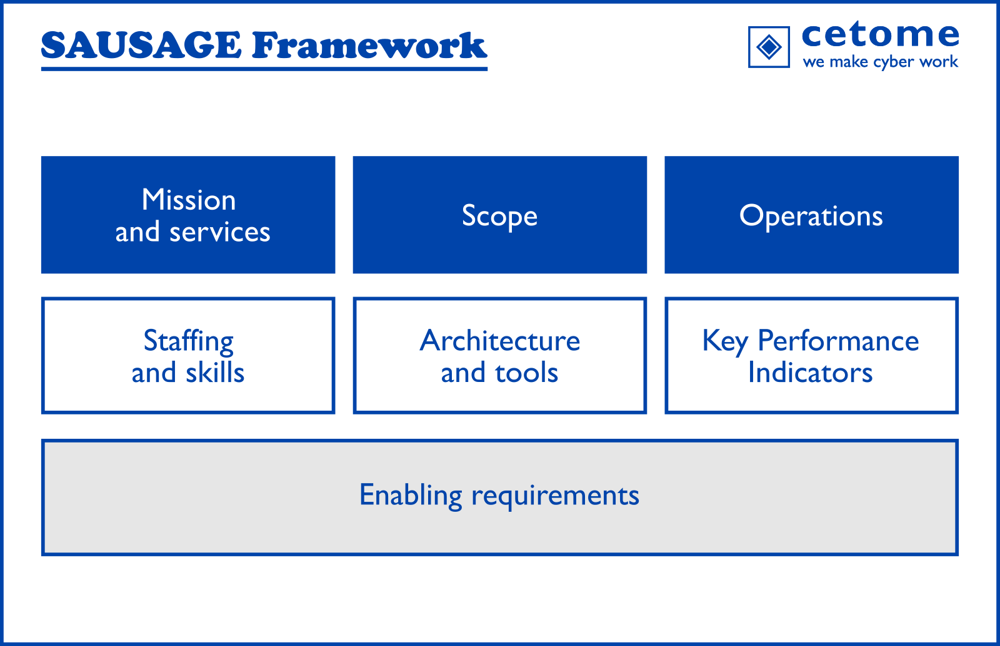

# cetome SAUSAGE Framework - SOC Assistant for Useful Service And Greater Experience
A Security Operations Center (SOC) monitors assets to detect and manage potential security issues.
In today's world, having a SOC is becoming a necessity for many organisations.

The fastest way to implement a SOC is to use an external service (usually from Managed Security Service Providers).
However, everybody seems to be offering external SOC services. It becomes difficult to evaluate the quality of SOC services and optimize budget by avoiding unnecessary services.

For that purpose, we created the SAUSAGE framework, a SOC Assistant for Useful Service and Greater Experience with your external SOC provider.

SAUSAGE helps you to:
- Identify SOC requirements that fit your needs
- Create a request for proposal for consulting SOC providers
- Evaluating suppliers to select the most appropriate one

**SAUSAGE** is the framework to identify SOC requirements, create an RfP and analyse the outcome. We are working on **MUSTARD** (Multiple Users SOC To Achieve Real Defence) to build this RfP. More simply, SAUSAGE is the first SOC procurement framework available publicly.

SAUSAGE was developed using multiple references from academia, ENISA, FIRST, SANS and others.

## Why the name SAUSAGE?
SOC is good. In French, "_soc is_" can be read _saucisse_ (_sausage_ in English). And we all agree that _saucisse_ is good.
Like a real sausage, the SAUSAGE framework mixes different ingredients to achieve a great result.

# What's in the framework
The framework has 7 core sections with different subsections.

A visual interface of the SAUSAGE framework at [sausage.cetome.com](https://sausage.cetome.com).

## [1. Mission and services](#mission-and-services)
- [Security events and incidents](#security-events-and-incidents)
- [Threat management](#threat-management)
- [Vulnerabilities](#vulnerabilities)
- [Risk management](#risk-management)
- [Security administration](security-administration)

## [2. Scope](#scope)
- [IT systems](#it-systems)
- [IoT systems](#iot-systems)

## [3. Operations](#operations)
- [Operational model](#operational-model)
- [Integration with your organisation](#integration-with-your-organisation)
- [Business relationships](#business-relationships)

## [4. Staffing and skills](#staffing-and-skills)
- [Staffing](#staffing)
- [Skills](#skills)
- [Organisation of the SOC](#organisation-of-the-soc)

## [5. Architecture and tools](#architecture-and-tools)
- [Tools](#tools)
- [Logs](#logs)
- [SOC security](#soc-security)
- [Remote access](#remote-access)

## [6. Key Performance Indicators](#key-performance-indicators)
- [Reporting requirements](#reporting-requirements)
- [Metrics](#metrics)

## [7. Enabling requirements](#enabling-requirements)
- [Governance and project management](#governance-and-project-management)
- [Change management](#change-management)

# The SAUSAGE Framework

## Mission and Services
The SOC must provide added-value to the organisation.

### Security events and incidents
- **Security event analysis**: the SOC manages and triage of security events
- **Incident handling**: the SOC manages security incidents after triage. It is usually done for low risk incidents
- **Forensics**: the SOC looks for root cause issues of security incidents

### Threat management
- **Threat intelligence**: the SOC produces threat intelligence to alert on the threats exposure for the assets in scope
- **Threat hunting**: the SOC attempts to discover live threats in the assets in scope from known indicators, artefacts or TTPs

### Vulnerabilities
- **Vulnerability discovery**: the SOC discovers vulnerabilities through scanning or using correlation with an asset management system (e.g. CMDB)
- **Vulnerability management**: the SOC manages vulnerabilities, from triage to remediation (including patching)

### Risk management
- **Offensive security services**: the SOC performs assessments of the security posture via penetration testing, red teaming, purple teaming for the assets in scope
- **Security awareness and exercises**: the SOC organizes security awareness campaigns and exercises to your staff

### Security administration
- **Security architecture**: the SOC develops and implements secure architecture for the assets in scope or assets interacting with these
- **Security administration**: the SOC manages the security requirements for the assets in scope (configuration, update)

## Scope
The mission and services apply to the assets in scope​.
### IT systems
- **[IT] Cloud**: the SOC monitors IT Cloud systems and associated services (Office 365, Emails, SaaS, etc.) to detect phishing attempts, malware, data leaks
- **[IT] Network**: the SOC monitors the network perimeter, internal network and/or remote accesses to detect suspicious access, data leaks and lateral movements.
- **[IT] Privileged users**: the SOC monitors the behaviour of privileged accounts, including logging attempts, out of hours usage, etc. to detect abuse and potential escalation of privileges.
- **[IT] All users**: the SOC monitors user behaviour and user account to detect login attempt, stolen accounts, etc. This includes human and machine accounts.
- **[IT] Data**: the SOC monitors the data stored on IT systems to detect unauthorized access, mass download / deletion, ransomware, etc.
- **[IT] Endpoints**: the SOC monitors IT endpoints to protect against malware, ransomware, data leak, etc.
- **[IT] Compliance monitoring**: the SOC monitors the application of policies for asset configuration and operations, to detect issues and gaps. For example: lack of MFA, lack of encryption or access control, breach of GDPR requirements, etc.

### IoT systems
IoT products acquired and deployed as well as IoT products released on the market.
- **[IoT] Cloud**: the SOC monitors the Cloud infrastructure and associated services exposed to the Internet as well as Cloud-to-Cloud communications for IoT systems
- **[IoT] Internet communications**: the SOC monitors internet communications between IoT devices, mobile apps and Cloud systems to detect loss of service, unauthorized access, mass compromise, vulnerable environments, etc.
- **[IoT] Devices**: the SOC monitors individual devices to detect loss of service, unauthorized access (local or remote), compromise (for example Botnet), etc.
- **[IoT] LAN communications**: the SOC monitors LAN communications with the device to detect unauthorized access, compromise (for example Botnet), packet injection, degraded service, etc.
- **[IoT] Compliance monitoring**: the SOC monitors the policies on IoT products configuration and operations, to detect the lack of update, to ensure the success of remote update, to find known vulnerabilities actively exploited, etc.

## Operations
Service delivery follows a set model of operations​
### Operational model
- **Hours of operations**: define the operations of the SOC:
	- 24 x 7 (one site)
	- Follow the sun (multiple geographical sites)
	- Working hours only
	- Outside working hours only (for example you want a hybrid internal-external SOC)
	- No opinion

- **Service Level Agreement**: define the level of service provided day-to-day and in the event of a major global incident
	- Top priority
	- Acknowledged within 4 hours
	- Acknowledged within 24 hours
	- Acknowledged within 48 hours
	- Best effort

- **Structure of the SOC**: define the way the SOC operates, with a hierarchical or flat organization. This will be used to assess the SOC.
	- SOC manager and analysts (one person = one role)
	- Several levels of analysts (L1 analysts can escalate to L2 analysts)
	- Flat organization (managers do analysis)

### Integration with your organisation
- **Integration with your processes**: integration with your organisation existing processes for business continuity, reporting lines, out of hour support, etc. For example, can the SOC react directly or must contact someone internally?
	- The SOC can react directly for all incidents
	- The SOC can react directly for specific incidents or incidents above threshold
	- The SOC must contact you for specific incidents or incidents above threshold
	- The SOC must contact you for all events

- **Alerts and priorities**: define the rules to contact your organisation depending on the level of alert and priorities, including handling of important issues out-of-hour.
	- Alerts and priorities are defined by the SOC
	- Alerts and priorities defined by your organisation and the SOC must comply with them
	- Alerts and priorities defined together between your organisation and the SOC
		
- **Communication channels**: define internal and external communication channels to manage alerts and contact the relevant stakeholders.
	- Use of your ticketing system
	- Use of the telephone
	- Use of email
	- Use of a system in-house to the SOC
	- Other system of communication (Slack, Teams, Whatsapp, etc)

### Business relationships
- **Use of your data**: is your data collected by the SOC reintegrated and reused for other stakeholders, for example to provide Threat Intelligence services to their other clients?
	- Yes
	- Only for some data
	- No
	- No opinion	

- **External relationship**: the SOC can have working relationships with other SOCs or CERTs to address specific incidents for example.
	- Yes
	- Only for some services (precise which ones)
	- No
	- No opinion
	
## Staffing and skills
A SOC must have enough people with the right skillset to provide their services on the agreed scope.
Use this section to analyse the answers of your SOC providers.

### Staffing
- **Roles and Responsibilities**: Ensure the roles and responsibilities of the SOC support the operational model agreed previously. For example, it can be difficult to have a good level of service if one person has multiple roles.
	- One person = one role
	- One person = multiple pre-defined roles
	- Best effort				

- **Number of staff**: a higher number of staff offers insights on the capabilities to deliver advanced services. However it is not an indicator that shall be taken on its own.
	- 1-5 FTE
	- 5-10 FTE
	- \> 10 FTE				

- **Yearly staff turnover**: a higher turnover would affect the quality of service, as new staff needs time to feel at ease the environment.
	- \< 5%
	- 5-25%
	- 25%-50%
	- \> 50%			

### Skills
- **Staff specialism**: Having staff dedicated per service-line (such as threat intelligence, detection, etc.) can become very important when subscribing to services which require specialist skillset
	- No specialist staff
	- Some specialist staff (precise the services)
	- Most staff is specialist in 1 domain (number of staff per domains?)
	- Most staff is specialist in sevearl domain (how much staff, how many domains?)			

- **Awareness & training**: it is important to provide awareness and training to staff on the latest threats, the tools they use, the services they deliver. How is this delivered (in-house or via external partners), is it proposed and followed by all staff, is there any certification, is research time allocated to staff?
	- SOC provider does not provide awareness/training.
	- Staff maintain awareness/training on their free time.
	- Staff have time during work to maintain self-awareness and training
	- SOC provider offers general awareness / training to all staff
	- SOC provider offers role-based awareness and training
	- SOC provider develops training in house
	- SOC provider uses external partners for staff training
	- SOC provider offers certification to staff

### Organisation of the SOC
- **Staff assigned to your organisation**: is the staff assigned to your organisation dedicated to you only, working on multiple fixed accounts or fully dynamic?
	- Staff dedicated to your organisation (How many people? How many FTEs?)
	- Dedicated staff shared with multiple other clients (How many individuals? How many FTEs?)
	- Shared staff across all clients (How many individuals? How many FTEs?)

- **Continuity of service**: ensure the continuity of service. Are all positions doubled? What happens when dedicated staff leaves?
	- Covering for one member of staff is done on a case per case basis
	- SOC provider has a process to ensure all posts are covered during holidays, sick leave etc.
	- SOC provider has doubled all posts for a shift			

- **SOC Support staff**: is there any support staff in the SOC? For example, for the installation and maintenance of IT systems.
	- The same individuals operate the SOC and maintain its systems. SOC provider must provide the average time used for system maintenance in FTE or % of time per individual.
	- Dedicated staff is used. SOC provider must provide the number of FTE dedicated to this task as well as the % of dedicated staff vs number of operational people (analysts)
	- External suppliers are used. SOC provider must precise how many external suppliers are used, their name and their domains of responsibilities. SOC provider must explain how they assess the security of their suppliers and how long they have worked with them.
	
	
## Architecture and tools
The SOC must integrate with your existing architecture and tools.
Use this section to analyse the answers of your SOC providers.

### Tools
- **Tools used**: the tools used by the SOC must support the services delivered.
	- What tools are used?
	- Type of tools, name of the tools, etc.
	- Do we need to acquire a license? If so, what is the cost of the license?	

- **Integration with your systems**: do the SOC tools integrate with your existing systems?
	- Are specific licenses or arrangement required?
	- How is the SOC connected to our environment?

### Logs
- **Log collection**: The architecture and systems used to retrieve and store logs. For example, aggregation in a SIEM.​
- **Log format**: The format of logs to analyse. For example: XML, text, SQL.​
- **Log granularity**: The type and precision of events collected in logs. For example: unauthorised access vs all accesses.​
- **Log retention**: The time the logs are retained to find correlation and perform forensics. This defines the capacity of the storage system.​

### SOC security
- **SOC architecture**: The SOC architecture must support resilience.
	- Does the SOC use network segmentation?
	- Does the SOC use Cloud systems?
	- How are backup and logs protected?
	- The SOC must provide an architecture model
	- The SOC must provide their BCP/DRP and associated SLAs

- **SOC security posture**: the SOC must have at least a security level equivalent to what it protects.
	- How is this implemented and assured?
	- How often is the security tested and how?
	- Does the SOC monitor its own security?
	- Do we have the right to audit?
	- How are incidents at the SOC managed? Please provide the list of the latest incidents.
	- Is the SOC doing backups?
	- How is data secure?
	- How are access managed?
	- Is the SOC certified?
	- The SOC must provide its security policies

### Remote access
- **Remote monitoring**: does the SOC requires agents to be installed on the assets in scope? If so, what are the pre-requisites and limitations?
	- There is no agent, we only collect logs
	- Agents on specific assets (precise which agents for which assets and the associated requirements). Precise the assets out of scope.
	- Agents on all assets (precise which agents for which assets and the associated requirements)

- **Remote administration**: What systems are used by the SOC to administer the assets in scope? Do they require specific accounts? Is there any shared account?
	- The SOC uses a shared administrative accounts that we create for them
	- The SOC uses individual administrative accounts that we create for them
	- The SOC requires the use of a privileged access management (PAM) system. The SOC must explain who provides this system and its requirements.
	- The SOC uses certificates or API keys with the approriate permissions (the SOC must precise which ones)
	- The SOC stores all credentials in a password vault. The SOC must describe the security measures of this vault.

## Key Performance Indicators
The KPIs contribute to the evaluation of the SOC and to your continuous improvement​

### Reporting requirements
- **Reporting period**: define the reporting timeframe on the KPIs (weekly, monthly, quarterly, yearly). This can vary for different KPIs.
	- Daily
	- Weekly
	- Quarterly
	- Yearly	

- **Generation of report**: How are reports generated? Does it require manual input or is it automated?
	- Manual inputs	required
	- Automated reports
	
- **Reporting format**: can reports be integrated in your existing toolset? Are they available via an API or only files?
	- PDF / Excel by email
	- Web dashboard (the SOC must provide an overview)
	- In-house dashboard (API connection with the SOC)
	- API to our existing dashboard (please precise which tools you use)

### Metrics
- **Reporting metrics**: define the KPIs to report. These KPIs must be valuable to prevent cheating. For example:					
	- Time from detection to containment to eradication					
	- Time to discover all impacted assets and users					
	- Number of incidents handled					
	- Number of high / critical incidents					
	- Number of incidents with known vulnerability exploited					
	- Incident occurrence due to known vs. unknown vulnerability					
	- Number of tasks assigned to your organisation					
	- Duration of service loss per incident					
	- Thoroughness and accuracy of threat hunting					
	- Thoroughness of eradication (no recurrence of original or similar compromise)					
	- Avoidability of incident (could the incident have been avoided with security practices in place?)					
	- Financial cost per incident					

- **Reporting thresholds**: list of accepted values that demonstrate the efficacy of the SOC. This must be done per KPI.

- **Improvement thresholds**: thresholds that demonstrate the need for improvement internally or for the SOC. For example: 3 incidents exploiting a known vulnerability. This must be done per KPI.

## Enabling requirements
Identify your internal requirements and their availability to date: Fully available today, Partially available today, Unavailable today, Not necessary for the SOC, Unknown.

### Governance and project management
- **Governance requirements**: integration of the SOC reporting in existing security governance, processes, etc. for incident management and for continuous improvement.
	- List of security and data protection for the SOC supplier
	- List of processes where the SOC will integrate
	- List of procedures and/or playbooks to be followed by the SOC
	- List of interfaces (inputs and outputs) between your organisation and the SOC
	- Do you see other governance requirements? Please list them and mention their availability today.

- **Roles and Responsibilities**: identification of internal roles and their responsibilities for the SOC for project implementation and during operations

- **SOC project preparation**: ensure preparation of relevant documentation and assets to support the implementation of the SOC, such as:
	- Project management team
	- Policies, processes, procedures, playbooks
	- Network architecture and data flows
	- Supporting systems: Active Directory, IAM, asset inventory, SIEM, firewalls, etc. If possible, describe which systems are available today, and those you believe are needed but not available today. Note: the list of systems must be consolidated with the SOC provider in the study and implementation phases.
	- Source of logs, source of time, format of logs and minimum retention period. If possible, describe interesting sources of logs, their format and the minimum retention period.Note: the logging requirements must be consolidated with the SOC provider in the study and implementation phases.
	- Incident thresholds criteria
	- Asset criticality level
	- Correlations between logs
	- Attack scenarios
	- What other elements do you see to prepare the project?

### Change management
- **Implementation of changes**: implement and manage changes in the relevant documents, architecture, assets, to enable service delivery of the SOC: creation of a secure and unique time source, open ports, API keys, update processes, new accounts, etc. Note: this will depend on the answers to the previous items.

- **Awareness and training**: ensure internal staff are aware of the SOC and know about it, how it integrates with their tools, etc.
